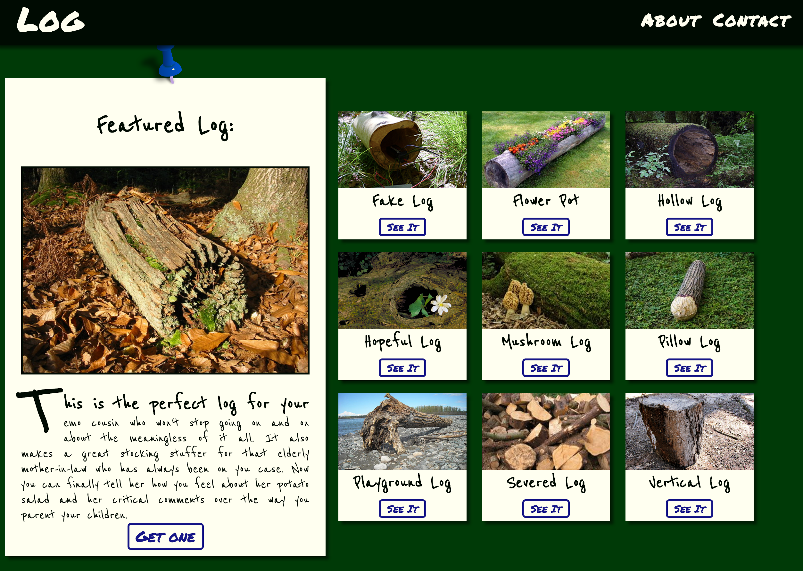

# _Top 8_

#### _Week 1 CSS code review (advertising LOGS!) showing pseudo elements/classes, absolute/relative positioning, and floats {Nov 18th, 2016}_

#### See it live [HERE](https://kylelange.github.io/log/).
_

#### By _**Kyle Lange**_

## Description

The expectations are as follows:

It must include:

* At least one centered element

* A list or summary of features (lorem ipsum is fine)

* At least one large image with an absolutely positioned caption

* At least one table or form field styled with CSS (e.g. sizing chart, color options, order form…)

* A gallery of smaller images (e.g. similar products...)

* Use of at least one pseudo class and one pseudo element

* Use of at least 3 different types of selectors

* Appropriate elements are positioned using absolute & relative positioning

* Gallery images make use of the float property

* Elements use box-sizing: border-box;

* Project is in a polished, portfolio-quality state.

## Setup/Installation Requirements

1. Download this repo using your terminal: git clone repo-name pasted here

2. View the code by drag-and-dropping the file into your [favorite text editor](https://atom.io)

3. run/check-out the program by dropping the index/html file from your folder into your web browser

## Known Bugs

_There are no known bugs as of the last commit. Please send an ISSUE on github in the repository if you see something I have not._

## Support and contact details

For questions, concerns, or suggestions please email baronsintrees@gmail.com

## Technologies Used

* HTML5
* CSS3
* JavaScript with jQuery 3.1

### License

*This software is licensed under the MIT license.*

Copyright (c) 2016 **_Kyle Lange_**
